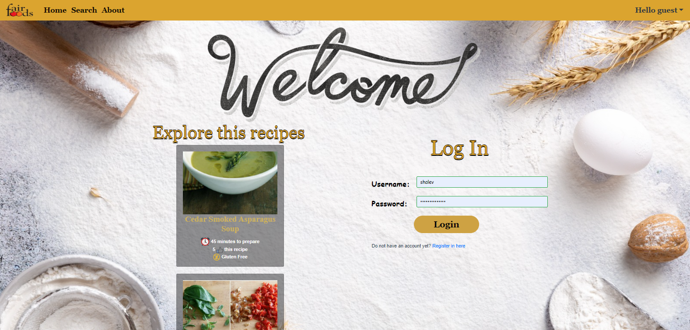
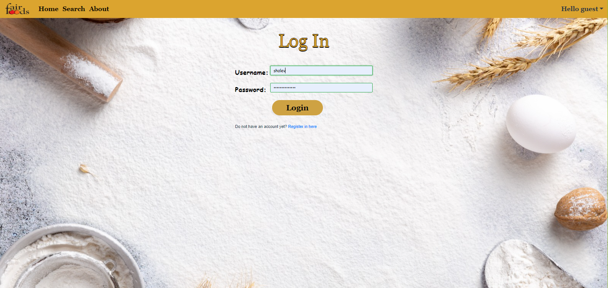
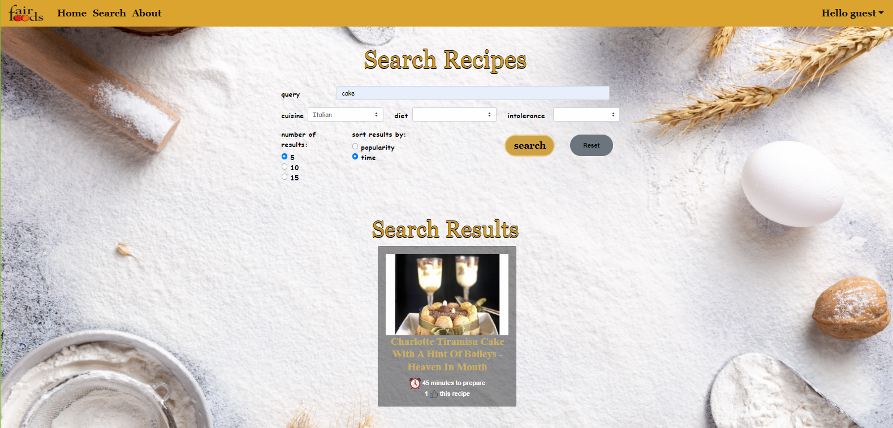
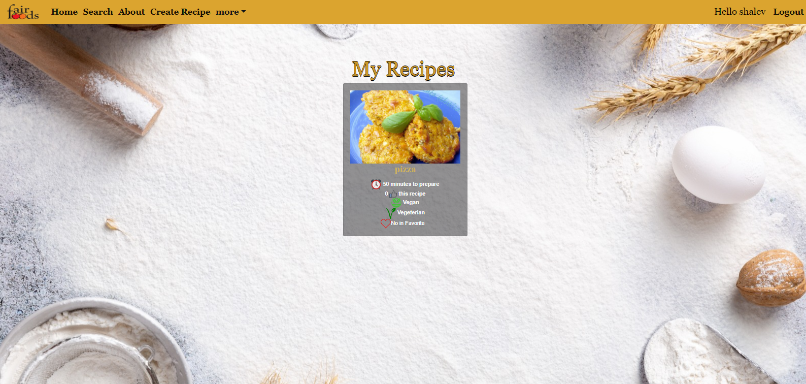
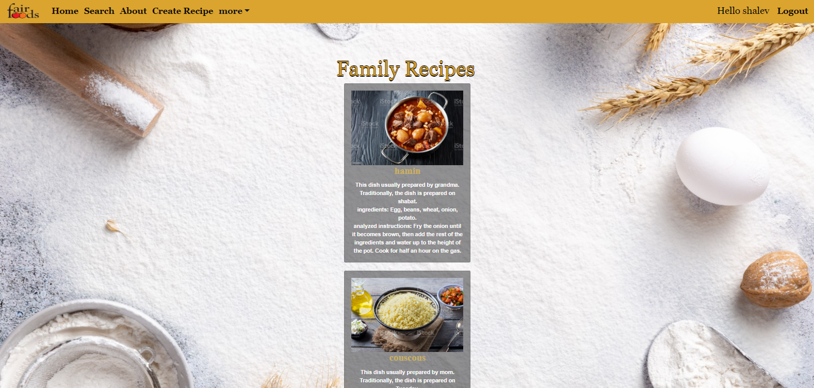
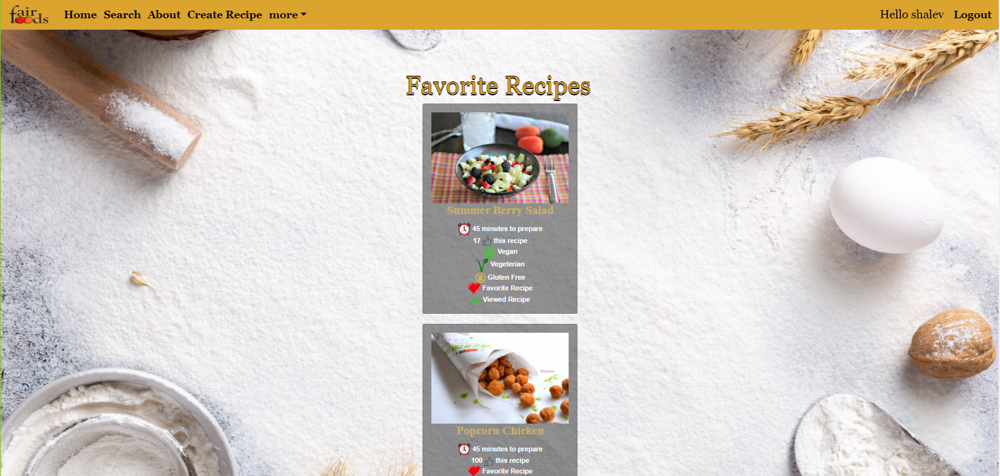
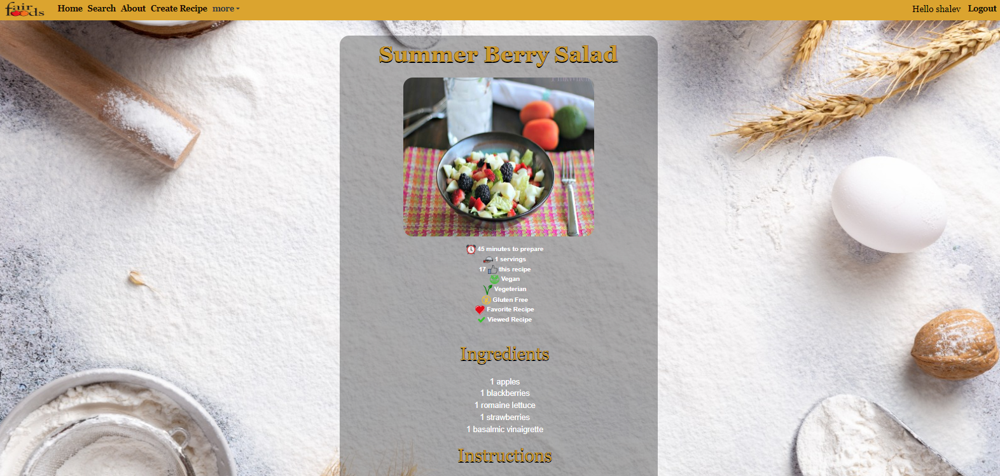

# Fair Food - Recipes Website

##  About The Website

Our site is a recipe site that offers a wide variety of options. You can search and filter options to find the desired recipes, you can also register, connect and add personal recipes, family recipes, add recipes you liked to favorites and more. For each recipe you can see a wide view showing details such as preparation time, number of portions, preparation instructions, ingredients, etc. On the site you can also type in the old recipes you entered and random recipes that will be presented to you. Hope you enjoy!

---

## Link to Server Side

[Server Side](https://github.com/Web-Development-Environments-2023/assignment3_2-211700844_206636805)

____________________________________________

## Examples of Pages from the site

- Welcome Page:

- Login Page:

- Search Page:

- Register Page:

- My Recipes:

 
- Family recipes:

- Favorite recipes:

- Full view of a recipe:

---

## Open in Visual

